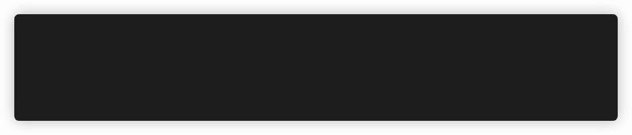

# Minimal CLI Spinner



## Example

```go
package main

import (
    "fmt"
    "time"

    "github.com/lucasepe/spinner"
)

func main() {
    fmt.Println("This may take some time:")

    s := spinner.StartNew("Task 1: Processing...")
    time.Sleep(3 * time.Second)
    s.Stop()
    fmt.Println("✓  Task 1: Completed")

    s = spinner.NewSpinner("Task 2: Processing...")
    s.Start()
    s.SetSpeed(100 * time.Millisecond)
    time.Sleep(3 * time.Second)
    s.SetText("About to change spinner shape...")
    time.Sleep(1 * time.Second)

    s.SetCharset([]string{"☱", "☲", "☴"})
    s.SetText(" Shape changed")
    time.Sleep(1 * time.Second)
    s.SetText(" Task 2: Processing...")
    time.Sleep(3 * time.Second)
    s.Stop()

    fmt.Println("✓  Task 2: Completed")
}

```

### Credits

This is a modified version of [https://github.com/janeczku/go-spinner](https://github.com/janeczku/go-spinner).